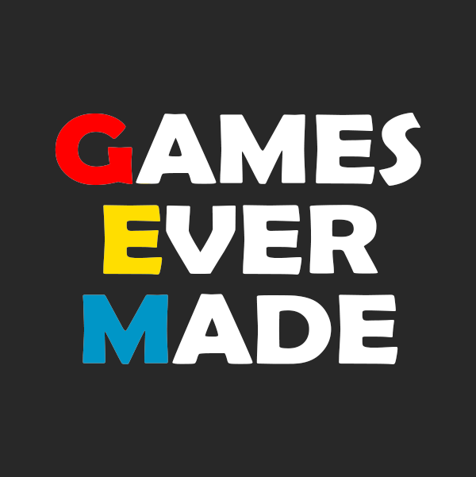

[JAVASCRIPT__BADGE]: https://img.shields.io/badge/Javascript-000?style=for-the-badge&logo=javascript
[KRITA__BADGE]: https://img.shields.io/badge/Krita-203759?style=for-the-badge&logo=krita&logoColor=EEF37B
[PHOTOSHOP__BADGE]: https://img.shields.io/badge/Adobe%20Photoshop-31A8FF?style=for-the-badge&logo=Adobe%20Photoshop&logoColor=black
[ITCHIO__BADGE]: https://img.shields.io/badge/Itch.io-FA5C5C?style=for-the-badge&logo=itchdotio&logoColor=white
[TRELLO__BADGE]: https://img.shields.io/badge/Trello-0052CC?style=for-the-badge&logo=trello&logoColor=white
[GIT__BADGE]: https://img.shields.io/badge/GIT-E44C30?style=for-the-badge&logo=git&logoColor=white

<div align='center'>
    
</div>
<a align="center" href="https://itch.io/jam/furries"> #1 Furry Game Jam website</a>

<h1 align="center" style="font-weight: bold;"> 🐈 Unlock the Sun 🌞 </h1>

<div style="padding: 0px 0px 0px 26px">

[](https://github.com/ellerbrock/open-source🐈-badge/)
[](https://github.com/ellerbrock/open-source-badge/)
</div>
<br>

<div align='center'>

[](https://godotengine.org)
![krita][KRITA__BADGE]
![photoshop][PHOTOSHOP__BADGE]
[![itch.io][ITCHIO__BADGE]](https://games-ever-made.itch.io/unlock-the-sun)
![trello][TRELLO__BADGE]
![git][GIT__BADGE]

</div>

<p align="center">
 <a href="#about">About</a> • 
 <a href="#controls">Controls</a> • 
  <a href="#colab">Collaborators</a> •
 <a href="#references">References</a> •
 <a href="#aknowledges">Aknowledges</a> •
</p>

<p align="center">
    </img> 
</p>

<h2 id="started">📌 About  </h2>

The Bat Country Syndicate has blocked out the Sun to create an eternal night, but you have stolen the Astral Neon back. To save the day, race to the star and Unlock the Sun!

This game was made with Godot under 9 days for Furry Game Jam #1. The theme was "Blocked".

<p>Visit our project, clicking on the button bellow</p>

[![itch.io][ITCHIO__BADGE]](https://games-ever-made.itch.io/unlock-the-sun)

<br/>
<h2 id="controls">🕹️ Controls </h2>

| Input                     |        Description       |
|--------------------------:|:-------------------------|
| A and ←                   | Left                     |
| D and →                   | Right                    |
| W and ↑                   | Up                       |
| S e ↓                     | Down                     |
| Left mouse Button         | Parry                    |


<br/>

<h2 id="colab">🤝 Collaborators</h2>

Special thank you for all people that contributed for this project.

<table>
  <tr>
    <td align="center">
      <a href="https://github.com/lindotex">
        <br>
        <sub>
          <b>Alisson Lindote</b><br/>
          <i>Intern</i>
        </sub>
      </a>
    </td>
    <td align="center">
      <a href="https://github.com/andrew-mendes">
        <br>
        <sub>
          <b>Andrew Mendes</b><br/>
          <i>Art Master</i>
        </sub>
      </a>
    </td>
    <td align="center">
      <a href="https://github.com/fgil90">
        <br>
        <sub>
          <b>Felipe Gil</b><br/>
          <i>Dev Junior</i>
        </sub>
      </a>
    </td>
    <td align="center">
      <a href="https://github.com/MarceloLMoreira">
        <br>
        <sub>
          <b>Marcelo 'Holysparks'</b><br/>
          <i>Dev Senior</i>
        </sub>
      </a>
    </td>
  </tr>
</table>

<h2 id="references">📝 References </h2>

This is the list of games, articles, creators that we took inspiration to work in this project.
<table>
  <tr>
    <td align="center">
      <a href="https://play.google.com/store/apps/details?id=com.imangi.templerun&hl=en_IE">
        <br>
        <sub>
          <b>Temple Run</b><br/>
          <i>Imangi Studios</i>
        </sub>
      </a>
    </td>
    <td align="center">
      <a href="https://en.wikipedia.org/wiki/Far_Cry_3:_Blood_Dragon">
        <br>
        <sub>
          <b>Arkanoid</b><br/>
          <i>Ubisoft Montreal</i>
        </sub>
      </a>
    </td>
    <td align="center">
      <a href="https://en.wikipedia.org/wiki/Arkanoid">
        <br>
        <sub>
          <b>Far Cry: Blood Dragon</b><br/>
          <i>Taito Corporation</i>
        </sub>
      </a>
    </td>
    <td align="center">
      <a href="https://en.wikipedia.org/wiki/Star_Fox">
        <br>
        <sub>
          <b>Starfox</b><br/>
          <i>Nintendo</i>
        </sub>
      </a>
    </td>
  </tr>
</table>

<h2 id="aknowledges">Special tanks and Aknowledges</h2>

Here is our Special Thanks and Aknowledges for all of those who help us developing this project:

```cs
 {
    "Game design": {"Alisson Lindote", "Andrew Andruid”, "Felipe Gilgadev", "Marcelo Holy”},
    "Programming": {"Alisson Lindote", "Felipe Gilgadev", "Marcelo Holy"},
    "Graphic assets": "Andrew Andruid",
    "Composer": "Andrew Andruid",
    "Sound design": "Marcelo Holy"
 }
````

